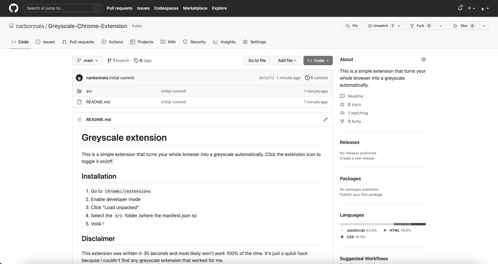

# Greyscale extension

This is a simple extension that turns your whole browser into a greyscale automatically. Click the extension icon to toggle it on/off.

## Installation

1. Go to `chrome://extensions`
2. Enable developer mode
3. Click "Load unpacked"
4. Select the `src` folder (where the manifest.json is)
5. Voilà !

## Preview

## Disclaimer

This extension was written in 30 seconds and most likely won't work 100% of the time. It's just a quick hack because I couldn't find any greyscale extension that worked for me.